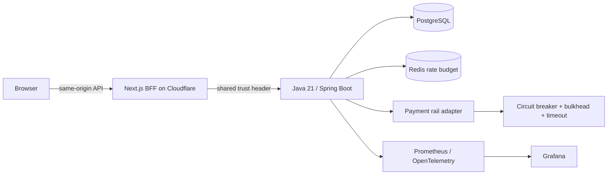

# V-Pulse

V-Pulse is a payment-reliability control plane built as portfolio evidence for backend, cloud-oriented, and full-stack roles. It demonstrates how a team can contain an unhealthy downstream payment rail, park uncertain work, and recover it through an explicit audited replay instead of retrying blindly.

## Live demo

- Application: [v-pulse-payment-ops.vmarket-vietdung2005.workers.dev](https://v-pulse-payment-ops.vmarket-vietdung2005.workers.dev)
- Backend readiness: [v-pulse-api.onrender.com/actuator/health/readiness](https://v-pulse-api.onrender.com/actuator/health/readiness)
- Public deployment proof: [docs/evidence/live-deployment.md](docs/evidence/live-deployment.md)

The backend uses Render's free web-service tier, so the first request after 15 minutes without inbound traffic can take about a minute while the container wakes up.

## Architecture



The browser never receives BFF or operations credentials. The Spring service uses short database transactions around state transitions; it does not hold a connection while waiting for a rail. A failed or timed-out authorization is persisted in the parking queue, while an interrupted `PROCESSING` instruction is recovered by a scheduled reconciler.

## What is implemented

- Java 21 virtual-thread rail calls with a 250 ms timeout, per-rail semaphore bulkhead, and Resilience4j circuit breaker.
- PostgreSQL state machine, Flyway migration, attempt history, parking queue, operator audit events, atomic replay claim, and stalled-work recovery.
- Atomic Redis Lua rate budget with an availability-preserving fail-open policy and metrics.
- Spring Boot Actuator health probes, Prometheus metrics, OpenTelemetry bridge, and a provisioned Grafana dashboard.
- Next.js 16 BFF allow-list, server-only credential injection, strict CSP, and a responsive incident control plane.
- Non-root multi-stage Docker image, local Compose stack, and a Helm chart with probes, limits, HPA, PDB, NetworkPolicy, and hardened pod security context.
- Testcontainers integration tests, Vitest unit tests, Playwright operator-flow tests, dependency audit, and four-lane CI.

## Run locally

Prerequisites: Node.js 22, Java 21, and Docker.

```bash
cp .env.example .env.local
docker compose up --build -d
npm ci
npm run dev
```

Open `http://localhost:3000`; Prometheus is at `http://localhost:9090` and Grafana at `http://localhost:3001` (`admin` / `vpulse-local`). Demo seed data is enabled only by Compose; it defaults off in the application.

## Verification

```bash
npm run verify
npm run test:e2e
cd backend && ./mvnw verify
docker compose config --quiet
helm lint infra/helm/vpulse
```

See [pain-point evidence](docs/PAIN_POINT_PROOF.md), [architecture decisions](docs/ARCHITECTURE.md), [incident runbook](docs/RUNBOOK.md), and the [game-day postmortem](docs/POSTMORTEM.md).
