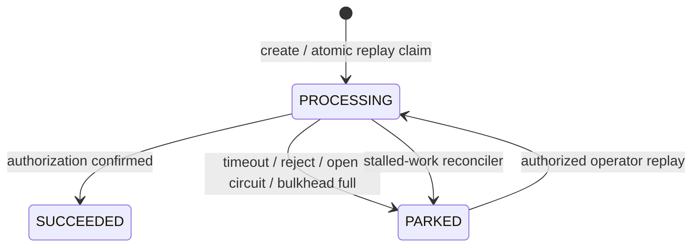

# Architecture decisions

## ADR-001 — Park uncertain work instead of automatic retry

Payment authorization can have an ambiguous outcome after a timeout. V-Pulse records one attempt and moves the instruction to `PARKED`. Recovery is an explicit operator action after the dependency is healthy. This favors safety and traceability over optimistic throughput.

## ADR-002 — Short transactions around external I/O

The service inserts or atomically claims an instruction, releases the database transaction, calls the downstream adapter, then finalizes the outcome in a new transaction. This prevents slow dependencies from exhausting the JDBC pool. A reconciler converts stale `PROCESSING` records to `PARKED` after two minutes.

## ADR-003 — Redis limiter fails open

Redis protects a rail from merchant bursts, but Redis unavailability must not become a global payment outage. The limiter therefore fails open and increments `vpulse.rate_limit{outcome="redis_error"}`. A real organization should connect this signal to paging and may choose fail-closed for a high-risk endpoint.

## ADR-004 — BFF is a narrow trust boundary

The browser can call only allow-listed payment-control paths. The BFF creates backend authentication and operations headers from server runtime secrets; incoming browser headers are never copied. Mutating demo controls and replay require the separate operations secret.

## Data states

Known production extensions are intentionally outside this portfolio scope: real rail adapters, merchant identity/authentication, multi-region consensus, and a durable message broker. They are not silently represented by mocks.

## Adapter compatibility note

Next.js 16 names request interception `proxy.ts` and runs it on Node.js. OpenNext Cloudflare 1.20.2 rejects Node proxy bundles and still requires edge `middleware.ts`. V-Pulse deliberately keeps the deprecated filename for nonce-based CSP until the adapter supports the new convention; `npm run cf:build` is a CI gate so this compatibility shim cannot silently break.
