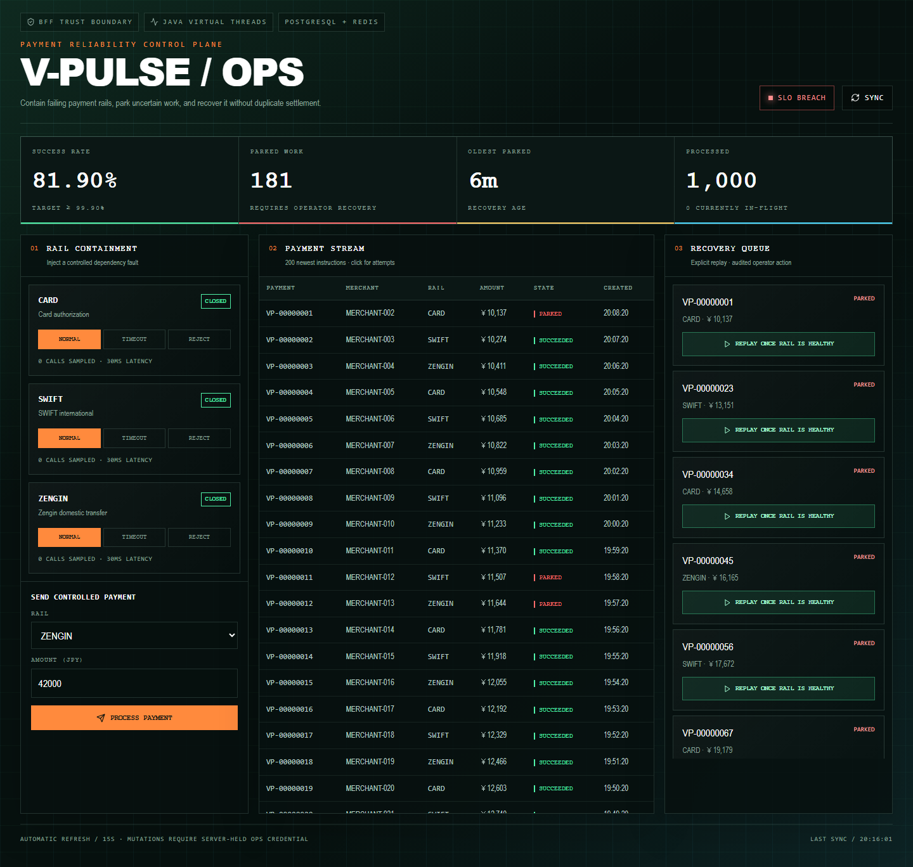
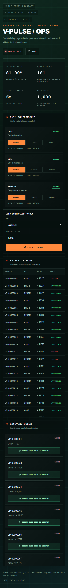

# Live deployment evidence

Validated on 2026-08-20 against the public deployment.

| Layer | Evidence |
| --- | --- |
| Cloudflare Worker + Next.js BFF | `https://v-pulse-payment-ops.vmarket-vietdung2005.workers.dev` returned HTTP 200 |
| Spring Boot readiness | `https://v-pulse-api.onrender.com/actuator/health/readiness` returned HTTP 200 |
| Reliability overview through BFF | `GET /api/control/reliability/overview` returned HTTP 200 |
| Payment and rail APIs through BFF | `GET /api/control/payments` and `GET /api/control/rails` returned HTTP 200 |
| Controlled write path | A synthetic ZENGIN payment (`VP-4D4D287D4C3D`) completed as `SUCCEEDED` through the public BFF |
| Browser QA | Chromium desktop and 390×844 mobile passed with no console errors |

The deployed backend source commit was `3fe24e8`; the Cloudflare compatibility documentation was deployed from `9b688b2`. Operations credentials remain in provider secret stores and are injected only by the BFF.

